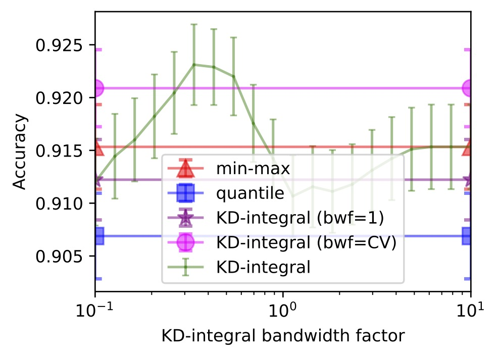
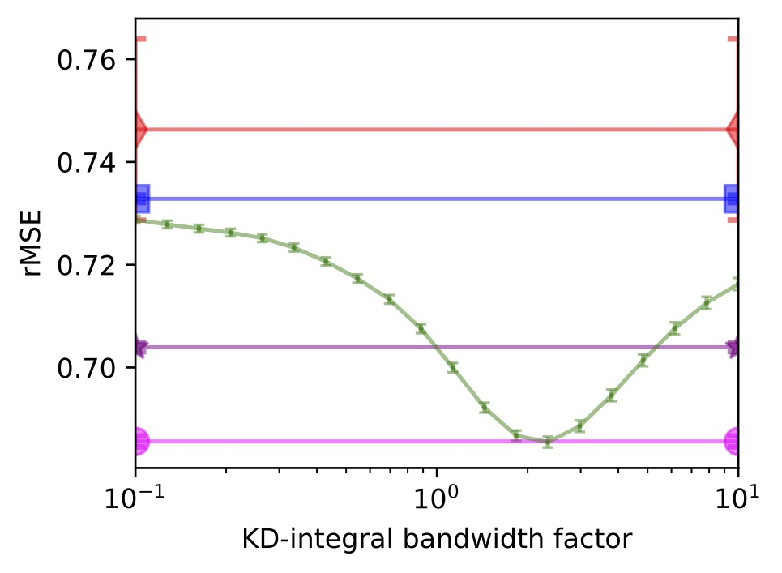

# kditransform

The kernel-density integral transformation, like [min-max scaling](https://scikit-learn.org/stable/modules/generated/sklearn.preprocessing.MinMaxScaler.html) and [quantile transformation](https://scikit-learn.org/stable/modules/generated/sklearn.preprocessing.QuantileTransformer.html), maps continuous features to the range `[0, 1]`.
It achieves a happy balance between these two transforms, preserving the shape of the input distribution like min-max scaling, while nonlinearly attenuating the effect of outliers like quantile transformation.
It can also be used to discretize features, offering a data-driven alternative to univariate clustering or [K-bins discretization](https://scikit-learn.org/stable/modules/preprocessing.html#preprocessing-discretization).

You can tune the interpolation $\alpha$ between 0 (quantile transform) and $\infty$ (min-max transform), but a good default is $\alpha=1$, which is equivalent to using `scipy.stats.gaussian_kde(bw_method=1)`. This is an easy way to improves performance for a lot of supervised learning problems. See [classification-plots.ipynb](https://github.com/calvinmccarter/kditransform/blob/master/examples/regression-plots.ipynb) for example code and the [arXiv preprint](https://arxiv.org/abs/2309.10194) for a detailed description of the method.

<figure>
  <figcaption><i>Accuracy on Iris</i></figcaption>
  
</figure>
<figure>
  <figcaption><i>rMSE on CA Housing</i></figcaption>
  
</figure>
    

## Installation 

### Installation from PyPI
```
pip install kditransform
```

### Installation from source
After cloning this repo, install the dependencies on the command-line, then install kditransform:
```
pip install -r requirements.txt
pip install -e .
pytest
```

## Usage

`kditransform.KDTransformer` is a drop-in replacement for [sklearn.preprocessing.QuantileTransformer](https://scikit-learn.org/stable/modules/generated/sklearn.preprocessing.QuantileTransformer.html). When `alpha` (defaults to 1.0) is small, our method behaves like the QuantileTransformer; when `alpha` is large, it behaves like [sklearn.preprocessing.MinMaxScaler](https://scikit-learn.org/stable/modules/generated/sklearn.preprocessing.MinMaxScaler.html).

```
import numpy as np
from kditransform import KDITransformer
X = np.random.uniform(size=(500, 1))
kdt = KDITransformer(alpha=1.)
Y = kdt.fit_transform(X)
```

`kditransform.KDIDiscretizer` offers an API based on [sklearn.preprocessing.KBinsDiscretizer](https://scikit-learn.org/stable/modules/generated/sklearn.preprocessing.KBinsDiscretizer.html). It encodes each feature ordinally, similarly to `KBinsDiscretizer(encode='ordinal')`.

```
from kditransform import KDIDiscretizer
rng = np.random.default_rng(1)
x1 = rng.normal(1, 0.75, size=int(0.55*N))
x2 = rng.normal(4, 1, size=int(0.3*N))
x3 = rng.uniform(0, 20, size=int(0.15*N))
X = np.sort(np.r_[x1, x2, x3]).reshape(-1, 1)
kdd = KDIDiscretizer()
T = kdd.fit_transform(X)
```

Initialized as `KDIDiscretizer(enable_predict_proba=True)`, we can also output one-hot encodings and probabilistic one-hot encodings of single-feature input data.

```
kdd = KDIDiscretizer(enable_predict_proba=True).fit(X)
P = kdd.predict(X)  # one-hot encoding
P = kdd.predict_proba(X)  # probabilistic one-hot encoding
```

## Citing this method

If you use this tool, please cite KDITransform
using the following reference to our [arXiv preprint](https://arxiv.org/abs/2309.10194):

In Bibtex format:

```bibtex
@article{mccarter2023kernel,
    title={The Kernel Density Integral Transformation},
    journal = {arXiv preprint arXiv:2309.10194},
    author={Calvin McCarter},
    year={2023},
}
```
